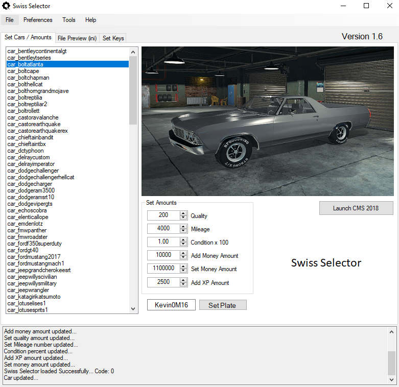
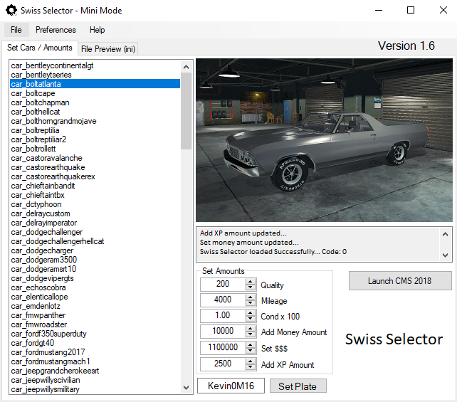

<link rel="shortcut icon" type="image/x-icon" href="ss3.ico">

# Swiss-Selector
CMS 2018 Mod

Swiss Selector is a tool for Car Mechanic Simulator 2018. It uses a modded version of the original dll file.

## Download - Update V1.6 for CMS 1.6.2.1 (DEC 25 2019)

New Look! Resized windows and added tabbed navigation

<pre>  </pre>

<!--</pre>
--> 

### Optional:
<!--<pre>  <a href="https://drive.google.com/open?id=14KZkmiyXTpEYJoY10v_utPYAD3ZMWK3U">.svg"/></a>   Note: extract Cars directory anywhere under steam folder</pre>-->

Original Car png's now included in the zip file above.
 
## Change Log
* [Changelog](https://github.com/Kevin0M16/Swiss-Selector/blob/master/CHANGELOG.md) - For viewing version history.

## Features
* Custom key mapping
* Swiss Selector grabs all Car names and if selected, sets this car for Spawn without manual editing the ini.
* Added the preference to Open Inventory if "duplicate part" is used. Preferences\Insert Part Options
* All quality and condition for duplicated parts is set within the Swiss Selector.
* All changes made on the Swiss Selector write the necessary ini files in real time automatically
* Built in log textbox for troubleshooting issues
* Image Preview of mod cars
* Option to skip Intro
* Ability to:
  * set parts or entire car to examined for condition
  * duplicate the engine on the engine stand
  * duplicate every part on the engine that is on the engine stand
  * set your money amount
  * add money
  * add XP
  * add Barns
  * delete all Barns
  * delete a car at Garage Entrance 1
  * generate a new Junkyard
  * Increase or Decrease player speed
  * Spawn a Car
  * Change config file to spawn
  * Change condition of car on mouseover
  * Change color of car on mouseover

<!--## Getting Started
Here is an overview of what you need to get started with Swiss Selector-->

## Installation and Setup
#### Requirements

The current version of Swiss Selector requires Car Mechanic Simulator 2018 version 1.6.2.1 and the modded dll file included in the .zip
 - [x] Car Mechanic Simulator 2018 version 1.6.2.1
 - [x] modded dll required - download .zip

:exclamation: **Always back up all your game data and saves before any mods** 
:exclamation: **Please follow directions! I'm NOT responsible for lost saves or corrupt game files**

#### Steps:
   1. Backup your Managed Folder:  Steam\steamapps\common\Car Mechanic Simulator 2018\cms2018_Data\Managed 
   2. Backup your saves folder: User\AppData\LocalLow\Red Dot Games\Car Mechanic Simulator 2018 
   3. Backup your dll file: Assembly-CSharp-firstpass.dll in the \Managed Folder 
   4. Place Swiss Selector.exe in Steam\steamapps\common\Car Mechanic Simulator 2018\cms2018_Data\Managed folder 
   5. Replace Assembly-CSharp-firstpass.dll with the dll from this repository 
   6. Create a shortcut to Swiss Selector.exe and place it on your desktop 
   7. Remove any existing ini files from the \Managed directory 
   8. Run Swiss Selector.exe 
   9. When prompted, build swiss.ini and keys.ini note: Swiss Selector must be in \Managed folder! 
   10. If all fields populate then continue, otherwise manually select \Managed folder under File 
   11. Check if the car names have populated on the left. If car names listbox is empty, click Advanced\manually select \Managed   location and Select your root directory of all your car files. 
   12. Now you can select your car to spawn, money and xp amounts, and key mapping. Be sure to save your key bindings! 
   13. Leave Swiss Selector Open and then Open CMS 2018. Action keys are listed on Main Form. 
   14. Move the Cars directory anywhere under the Steam\ folder to get a preview of the stock cars. (Now included in zip file)
   15. Enjoy! 

## Default Key Functions

* :grey_exclamation: **MAKE A BACKUP OF YOUR SAVE-GAME AND DLL!**
* :grey_exclamation: **SPAWN CAR DELETES ANY CAR AT GARAGE ENTRANCE A/1! MAKE SURE ITS EMPTY FIRST!**

#### :computer: :key: Keys:
* Keypad 1 - Spawn car at Garage Entrance A or 1
* Keypad 2 - Increase Config version of the car
* Keypad 3 - Decrease Config version of the car
* Keypad 4 - Randomly change the condition of the car under the mouse
* Keypad 5 - Randomly change the color of the car under the mouse (also works in editor)
* Keypad 6 - Reload Liveries (also works in editor)
* Keypad 7 - Set mileage of car under mouse as set on Swiss Selector
* KeyPad 8 - Generate Junkyard
* Keypad 9 - Fully repair car under the mouse
* Keypad 0 - Duplicate Engine on Engine Stand add to inventory and set condition/quality from ini file
* Keypad + - Increase speed
* Keypad - - Decrease speed
* Keypad / - Photo Mode
* F6 - Add all Engine parts from Engine on Engine Stand to inventory and set condition/quality on Swiss Selector
* F7 - Repair all items in inventory and set condition/quality from ini file.
* F8 - Add Barn
* F9 - Add (x) dollars -- Set in Swiss Selector
* F10 - Add (x) XP -- Set in Swiss Selector
* F11 - Unlock all upgrades (Re-enter garage to activate)
* End - Open Shop (also works in assembly mode)
* Insert - Add the selected part (not body parts!) to inventory
* ] - Rotate Engine Right on stand
* [ - Rotate Engine Left on stand
* PageUP - Entire Car under mouse is Examined
* PageDown - Part under mouse is Examined
* Delete - Delete car at Garage Entrance 1
* Shift + Delete - Delete all barns after save reload

## Built With

* [Visual Studio 2019](https://visualstudio.microsoft.com/downloads/) - For the Windows 10 UI
* [dnSpy](https://github.com/0xd4d/dnSpy) - To edit the dll file

## Authors

* **Kevin Lozano** - *Initial work* - [Kevin0M16](https://github.com/Kevin0M16)

## License

This project is licensed under the MIT License - see the [LICENSE](/LICENSE) file for details

## Acknowledgments

* Thanks to the people of the Car Mechanic Simulator Modding forum on Steam
* [Steam Community](https://steamcommunity.com/app/645630/discussions/1/1680315447982713687/) - CMS mod forum thread

